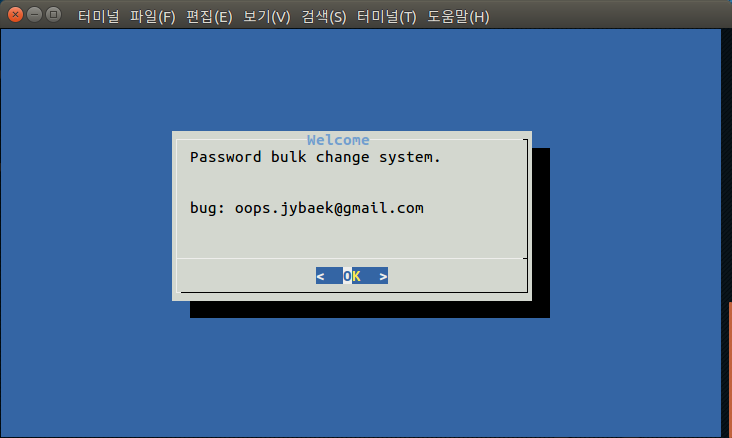
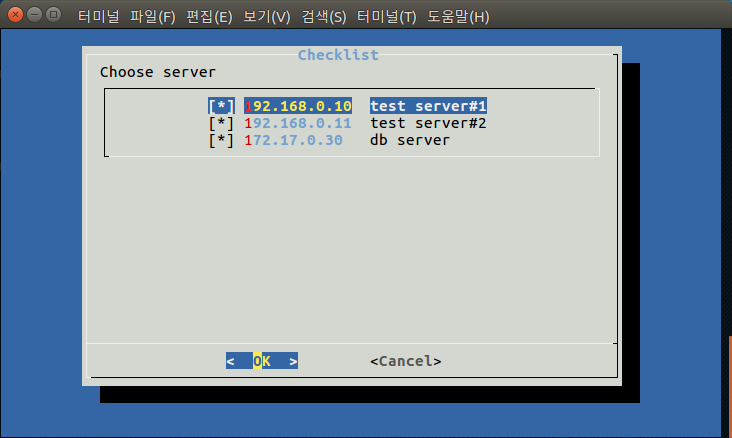
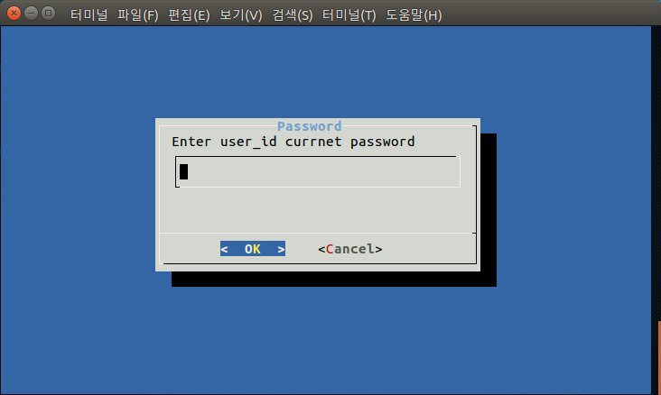
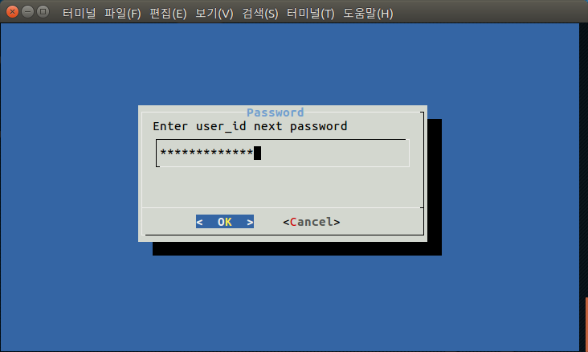

## summary
Change passwords for multiple servers at once.

## prerequisite
You need two commands, `dialog` and `sshpass`, that you can use in the shell.

## usage
```bash
$ chmod +x change_passwd
$ ./change_passwd
```

<div style="width:50%; margin:auto; margin-bottom:10px; margin-top:20px;">

</div>
Please select target server.
<div style="width:50%; margin:auto; margin-bottom:10px; margin-top:20px;">

</div>
Please enter your original password.
<div style="width:50%; margin:auto; margin-bottom:10px; margin-top:20px;">

</div>
Please enter a password to change.
<div style="width:50%; margin:auto; margin-bottom:10px; margin-top:20px;">

</div>
