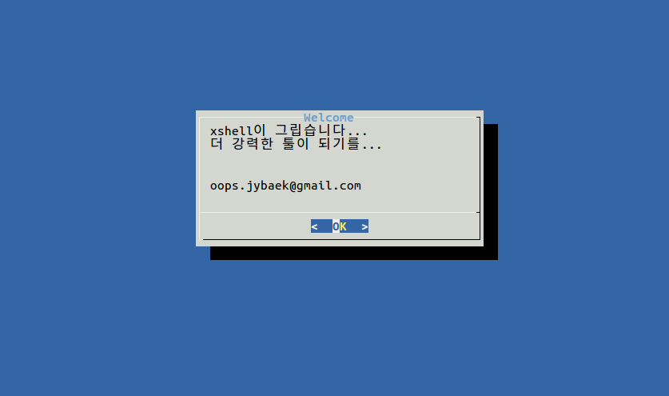
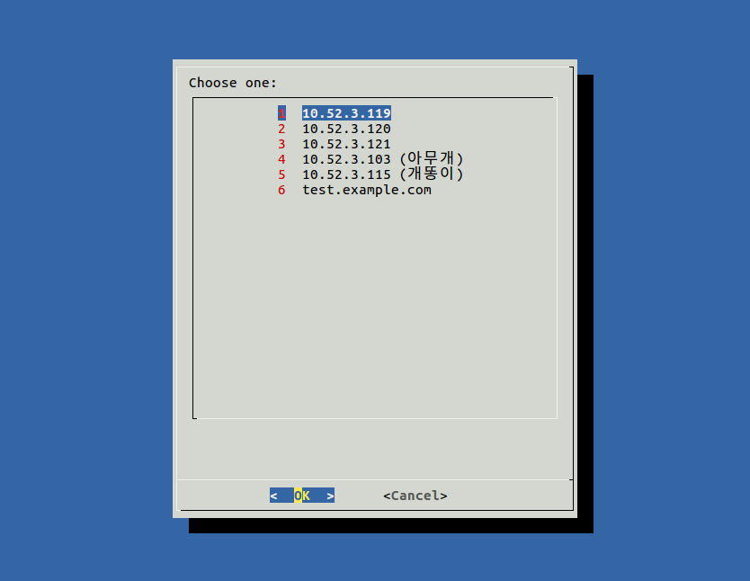

## summary
데스크탑OS를 ubuntu로 변경하면서 xshell이 그리워 만든 툴 입니다. (xshell이 리눅스 버전은 없더군요)

리눅스를 사용하면서 여러대의 서버를 관리하거나 기타 목적으로 여러대에 접속이 잦은 경우 많은 서버의 IP나 아이디, 비밀번호를 기억하는 것은 쉽지 않습니다. 또한 결정적으로 프롬프트에서 ssh 명령어 치고 비밀번호 입력하는 것도 귀찮... 그래서 만들어봤습니다. 

누군가에게는 유용하게 쓰일 수 있기를 바랍니다.

## usage
    $ connect_ssh
  

선택하면 자동으로 해당 서버에 접속됩니다.. ShellScript 안에 비밀번호를 텍스트 형태로 저장하기 때문에 보안이 취약하거나 공용으로 사용되는 서버에서는 사용하지 않도록 합니다.
