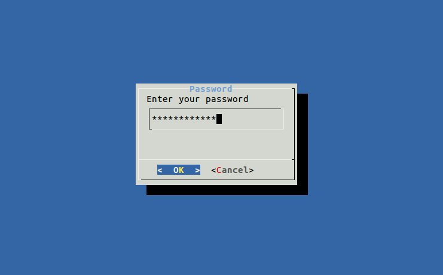

## summary
데스크탑OS를 ubuntu로 변경하면서 xshell이 그리워 만든 툴 입니다. (xshell이 리눅스 버전은 없더군요)

리눅스를 사용하면서 여러대의 서버를 관리하거나 기타 목적으로 여러대에 접속이 잦은 경우 많은 서버의 IP나 아이디, 
비밀번호를 기억하는 것은 쉽지 않습니다. 또한 결정적으로 프롬프트에서 ssh 명령어 치고 비밀번호 입력하는 것도 귀찮... 
그래서 만들어봤습니다. 

누군가에게는 유용하게 쓰일 수 있기를 바랍니다.

## usage
    $ connect_ssh
  

간단한 소개글을 작성할 수 있습니다.

선택하면 자동으로 해당 서버에 접속됩니다.

Shell script안에 비밀번호를 기록할 수 없는 서버의 경우를 위해 패스워드를 입력 받는 함수를 추가했습니다. 
`test.example.com`이 그 예제가 될 것입니다.
선택시에 아래와 같이 비밀번호를 묻는 창이 출력 됩니다. 서버에는 어떤 정보도 남기지 않습니다.

안심하고 사용하십시오.
