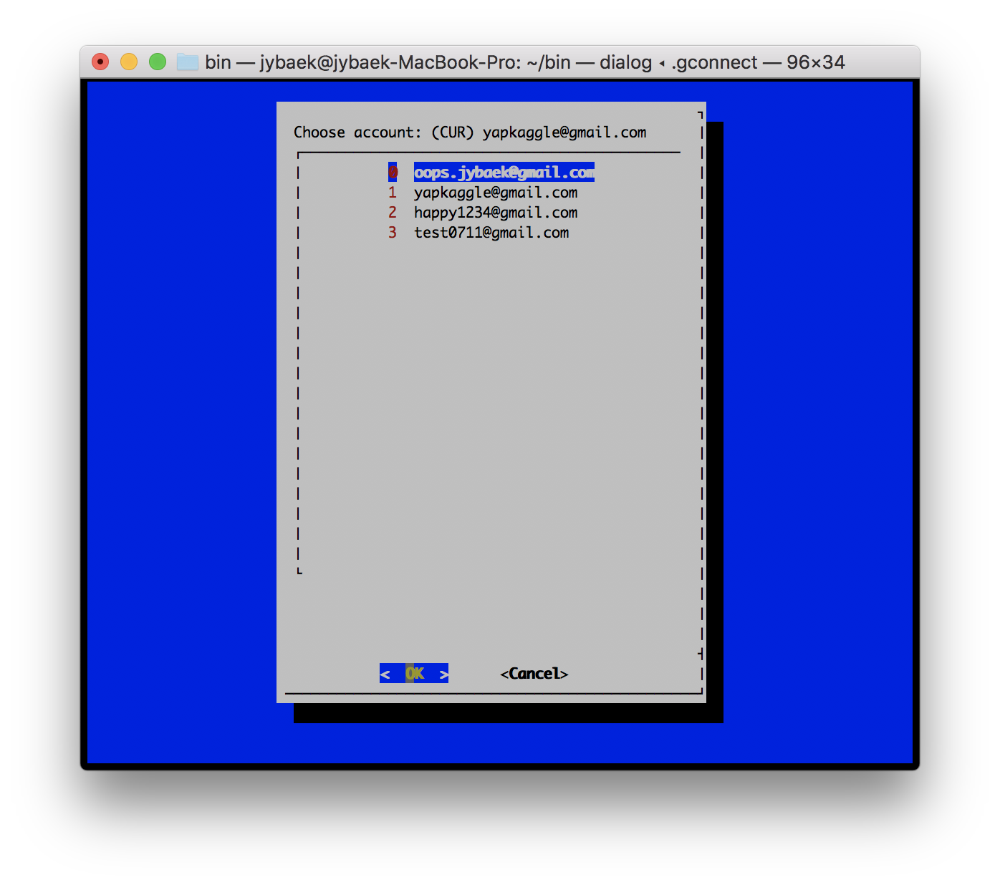

## summary
Google Cloud Platform (GCP) 를 사용하면서 무료 크레딧을 최대한 활용하고자 여러개의 계정을 운영하는 경우에 계정 전환을 조금 더 편하게 하고자 작성한 스크립트입니다.

## usage
    $ gcpconnector
  
명령어 실행시에 아래와 같이 현재 사용중인 계정 정보가 상단에 출력되고 운영가능한 계정 리스트를 보여줍니다. (이 부분을 수정하려면 손코딩이 약간 필요. 계정의 프로젝트 이름이나 Zone 등을 알 수 없기 때문에 자동화 못함)

항목을 선택하고 OK 를 누르면 계정이 전환됩니다. 혹시 계정추가를 코드상에 `ENVS` 변수를 편집하고 `for` 문안에 있는 `if` 조건문에 계정 정보를 추가해주시면 됩니다.
